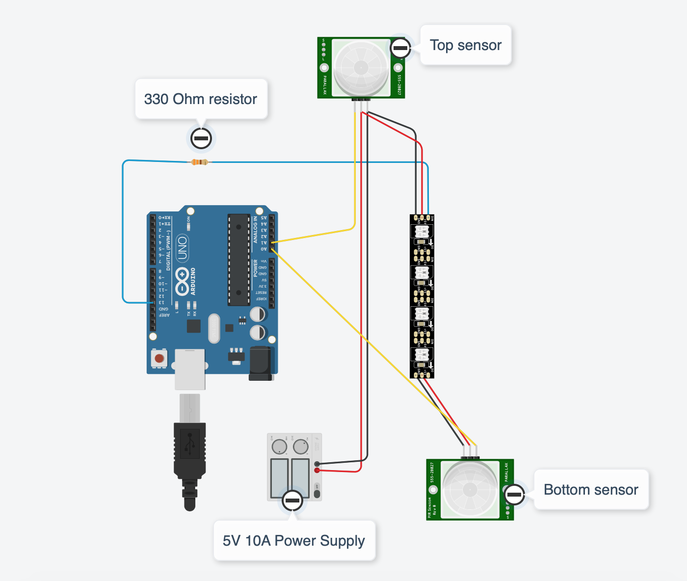

# stairleds

Motion activated staircase lights using an Arduino, PIR motion sensors, and a WS2812B LED strip.

The goal of this project is to have animated lighting underneath the handrail of a staircase that turns on when motion is detected at the top or the bottom using PIR motion sensors.

This project requires the FastLED library - https://github.com/FastLED/FastLED

See Arduino circuit design at the bottom.

Components:
* WS2812B LED strip
* PIR motion sensors (x2)
* 330 Ohm resistor
* 5v 10a power supply
* Solid single core wire (22AWG)
* Head shrink tubing

View of the lights going down the stairs.

The LEDs from the other side of the railing.

Bottom motion sensor is connected directly to the ground and 5V on the LED strip. The signal wire is running along side the LEDs to the Arduino.

Top motion sensor. Heat shrink tubing was used at the top and bottom to conceal solder points.

The LED strip had pre-installed adhesive that made mounting it to the underside of the handrail easy.

The Arduino is hanging at the top of the stairs using the mount that it came with. I still need to 3D print a case and tidy up the wiring. :)

Arduino circuit design

